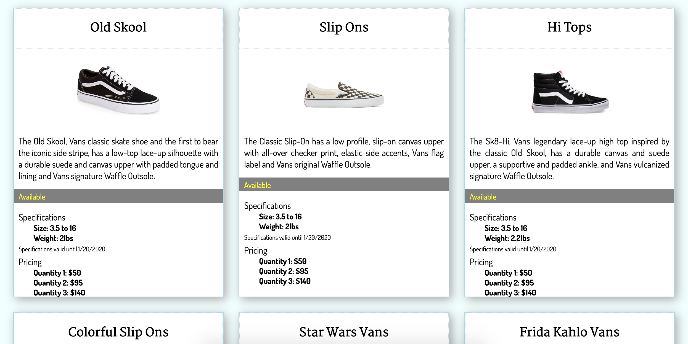
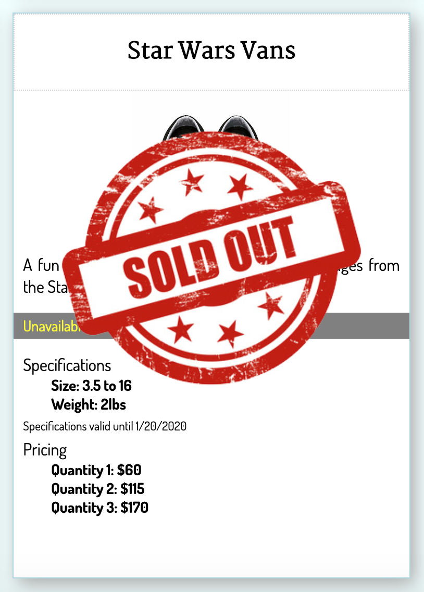

# Product Cards

## Description
This project was used as an introduction to HTML, CSS, and Flexbox. 

The goal was to create individual product cards with consistent, clean styles, and use Flexbox to position the cards in rows with 3 cards to a row. 

## Screenshots
Main Project View

Absolute positioned sticker

## How to run
1. Clone this repo
1. Make sure you have http-server installed via npm. If not get it [here](https://www.npmjs.com/package/http-server)
1. On your command line, run `hs -p 9999`
1. In your browser, go to `http://localhost:9999